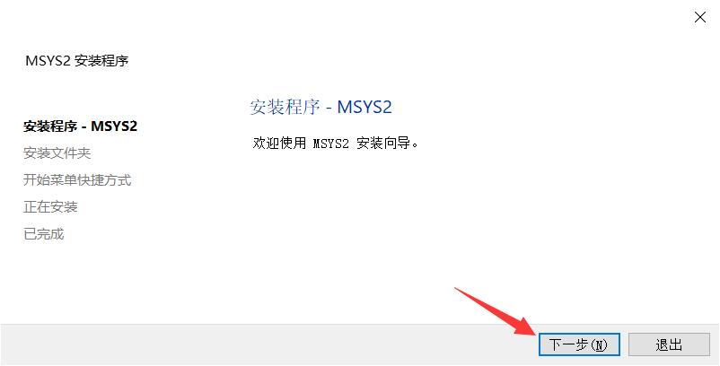
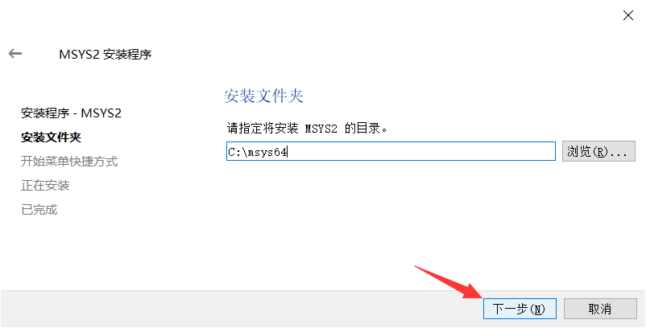
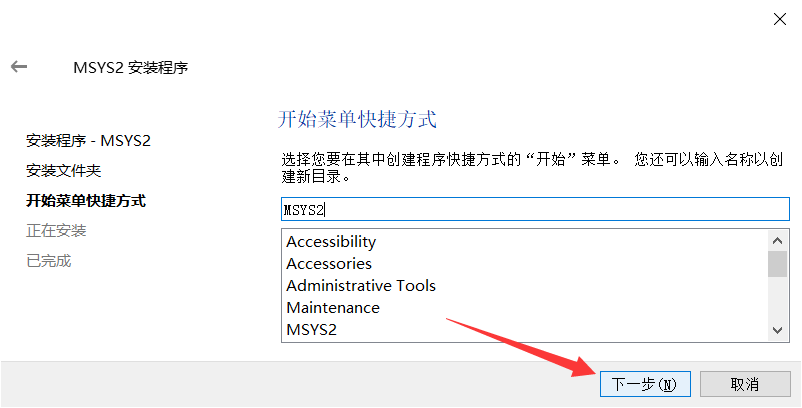
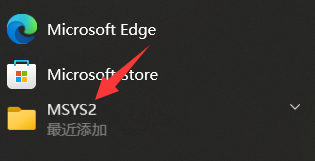
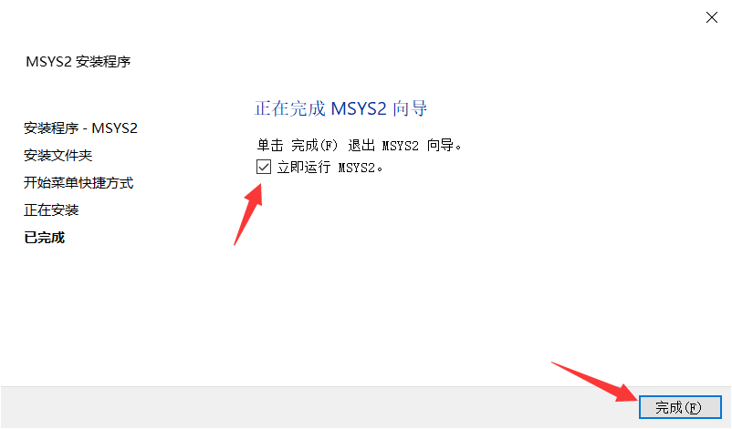
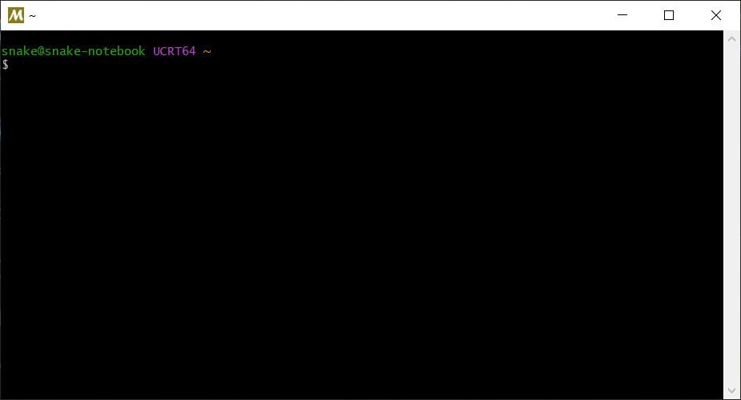
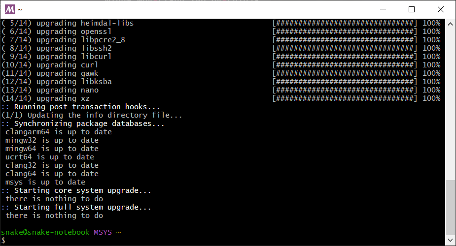

<!--
 * @Author: snake qzrobot_snake@outlook.com
 * @Date: 2022-12-31 15:35:10
 * @LastEditors: snake qzrobot_snake@outlook.com
 * @LastEditTime: 2022-12-31 16:09:23
 * @FilePath: \software\software\c++.md
-->
# c++配置
## 下载[MYS64](),它提供clang、MINGW等编程套件

### 下一步
---

### 自己选择你想要的安装路径,然后点下一步
---

### 选择你想要的开始菜单栏里的文件夹名称,就是图片中所指的文件夹名称

---

### 把立刻运行打开,然后点结束即可
### 这是结束后的界面

### 在里面输入以下内容
```cpp
pacman -S mingw-w64-clang-x86_64-toolchain mingw-w64-clang-x86_64-cninja mingw-w64-clang-x86_64-python-six mingw-w64-clang-x86_64-python-pip
pip install cmake_format
pacman -Syu
pacman -Syu
```
---
### MYS64会自动帮助你安装好

### 大概就是这样
### 中途有选项选y
### 完成!
---