# Git下载安装
## [我发布在csdn上的Git下载文件](https://download.csdn.net/download/cz20101010/87356159)
## 下载下来之后，双击点开
---
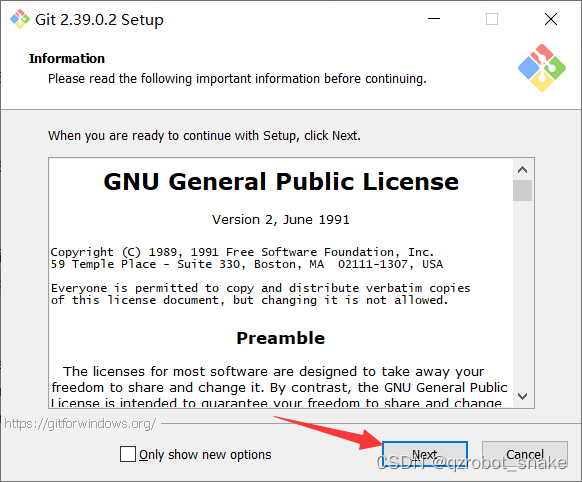
## 点Next(下一步)
---
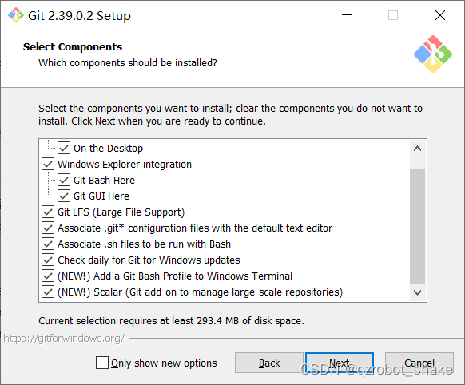
``` 
On the Desktop 在桌面创建图标
Git Bash Here 与 Git GUI Here 添加到右键菜单栏中
Git Large FileSupport Git支持大文件
Associate .git* configureation files with the default text editor 将.git文件关联的默认编辑器
Associate .sh files to be run with Bash 关联.sh文件Bash中运行
Check daily for Git for Windows updates 每天检查Git更新
(NEW!)Add a Git Bash Profile to Windows Terminal 将GitBash关联到Windows terminal
(New!)Scalar(Git add-on ro manage large-scale ##repositories) 使用Scalar(Git大文件管理插件)
```
## 建议全勾起来
---
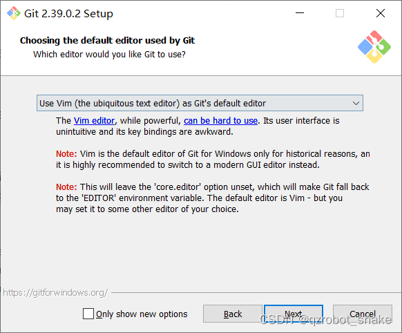
## 选择Git的默认的编辑器
## 建议不要动，直接Next
---
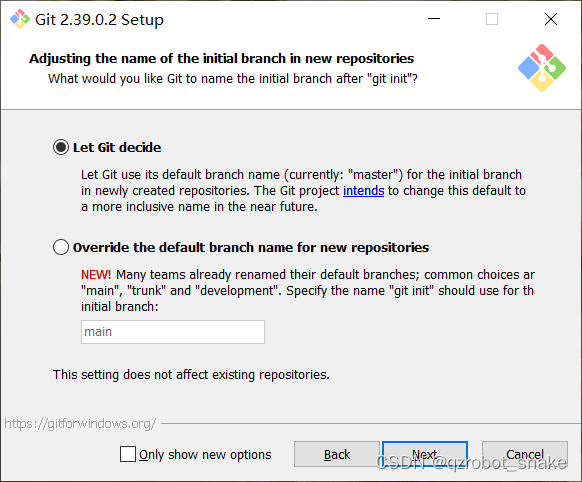
## 选择Git提交的默认分支名(第一个为master，第二个为自定义)
## 没有特殊需要，就选第一个
---
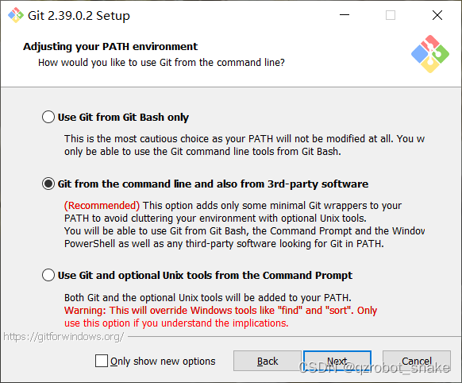
```
Use Git from Git Bash only 仅使用Git Bash
Git from the command line and also from 3rd-partysoftware 使用命令行与第三方的软件
Use Git and optional Unix tools from the Command Prompt使用Unix编辑器
```
## 推荐选第二个
---
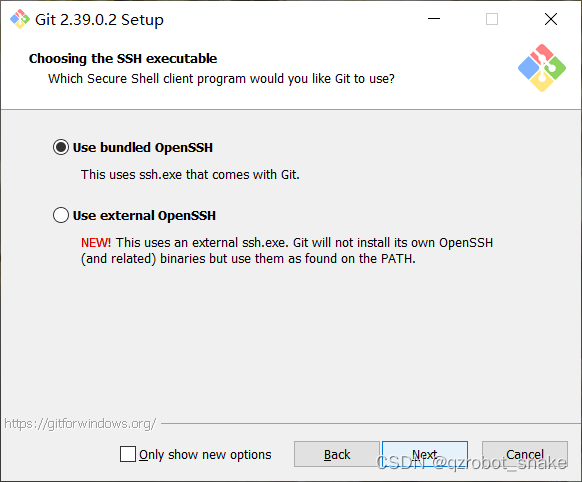
```
Use bundled OpenSSH 使用Windows的OpenSSH
Use external openSSH 使用外部的OpenSSH
```
## 推荐选第一个
---
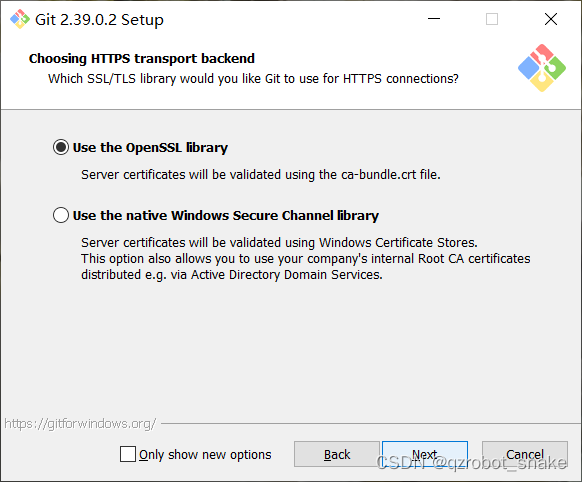
```
Use the OpenSSL library 使用OpenSSL库
Use the native Windows Secure Channel library 使用Windows 安全库
``` 
## 推荐选第一个
---
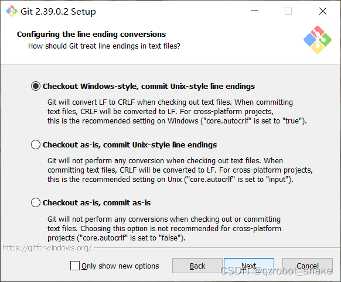
```
Checkout Windows-style,commit Unix-style line endings 将Windows格式的文件，以Unix的格式提交
Checkout as-is，commit Unix-style line endings 按Unix样式提交
Checkout as-is，commit as-is 按原样提交
```
## 推荐选第一个
---
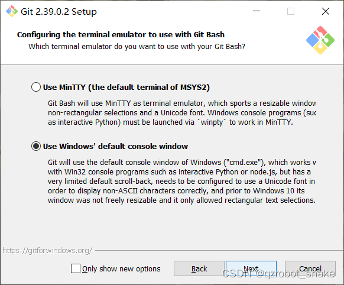
```
Use MinTTY（the default terminal of MSYS2） 使用MinTTY（Git默认编辑器）
Use Windows's default console window 使用windows默认控制台
```
## 推荐选第二个
---

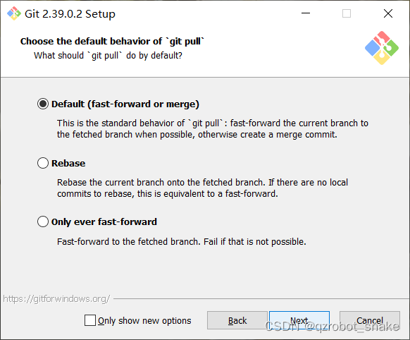
```
Default（fast-forward of merge） 快速合并（默认）
Rebase 将刚下载的版本设为最新版本
Only ever fast-forward 只能拉去获取到的分支，如果没有，则无效
```
## 推荐选第一个
---
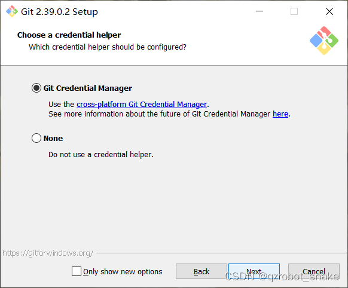
```
Git credential Manager 使用Git官方凭证
None 不适用凭证
```
## 推荐选第一个
---
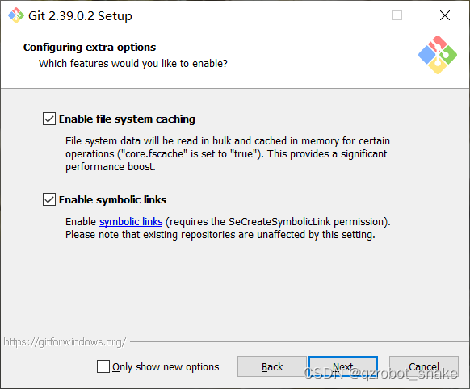
```
Enable file system caching 使用文件缓存
Enable symbolic links 使用符号连接
```
## 推荐全勾
---
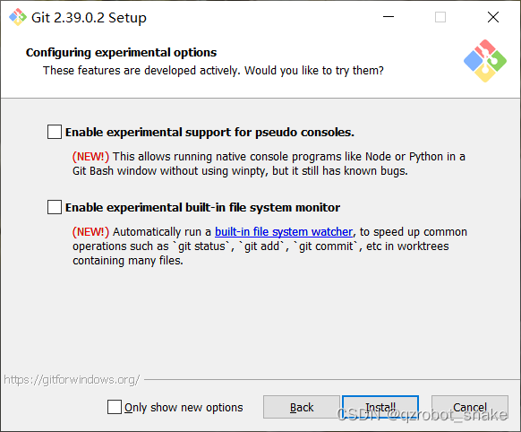
```
Enable experimental support for pseudo consoles 启用对伪控制台的实验性支持（有bug）
Enable experimental built-in file system monitor 启用实验性内置文件系统监视器
```
## 推荐全别勾
---
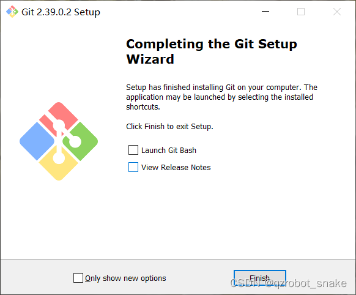
## View Release Notes最好别点，会打开Git文档
## 完成!